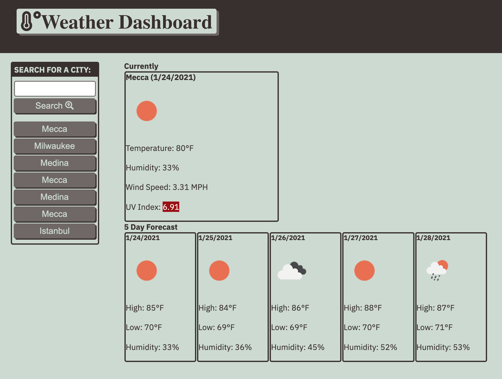

# Weather Dashboard

## Purpose
Displays weather outlook for a selected city.

## Built With
* HTML
* CSS from module 6 with tweaks
* JavaScript
* OpenWeather API
* Font Awesome
* Google Fonts

## Links
* Deployed Website - https://rolanduwxcc.github.io/ch6-weather-dashboard/
* GitHub Repo - https://github.com/rolanduwxcc/ch6-weather-dashboard
* OpenWeather API - https://openweathermap.org/api
* Font Awesome - https://fontawesome.com/
* Google Fonts - https://developers.google.com/fonts

## Contributions
* Warren Rowland

## Contact Info
* Warren Rowland - Find me on [Linked In](https://www.linkedin.com/in/linkedinrowland/) or [GitHub](https://github.com/rolanduwxcc)

## Screenshots

### ©️2020 Rolanduwxcc, Inc 